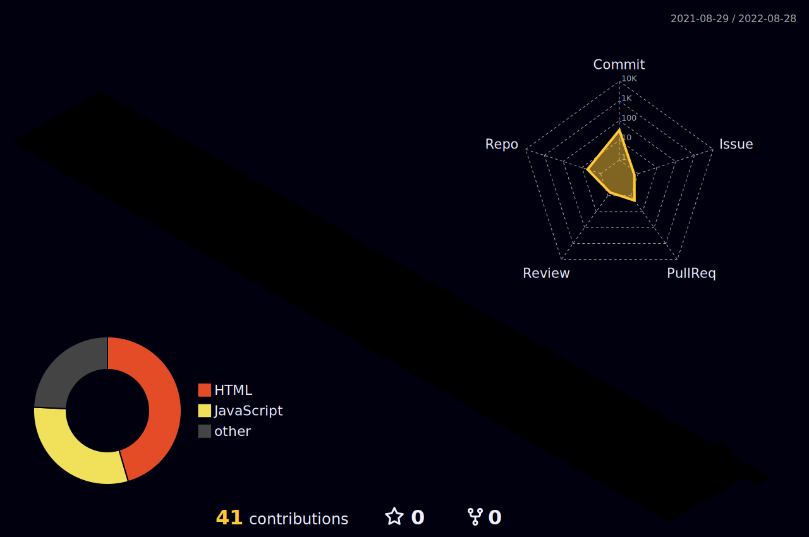

<h3 align="center">A passionate Backend developer from India</h3>

  

  

- 🔭 I’m currently working on **SpringBoot**

- 🌱 I’m currently learning **Backend Development**

- 💬 Ask me about **SpringBoot ,Hybernate**

- 📫 How to reach me **pankajsaraswatsharma@gmail.com**

- 📫 My Portfolio **https://heartfelt-kleicha-af3dd0.netlify.app/**

<h3 align="left">Connect with me:</h3>

<h3 align="left">🛠 &nbsp;Tech Stack </h3>

  
	
    
    
    
   
	

  

  
<h2 align="center">📊 My Github Stats<h2>

  <a href="https://Pankajsharma8221.dev/">
    
<!--  	#Stats card for later use  -->
 
    
    
  </a>

 

 
	

	  

	

	

   

